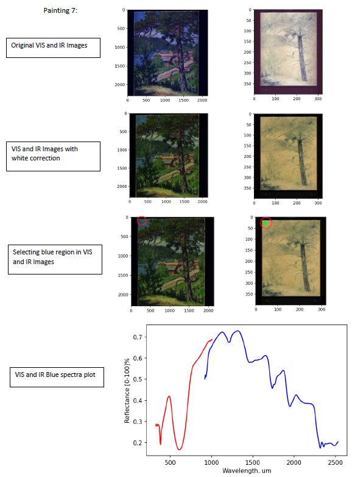
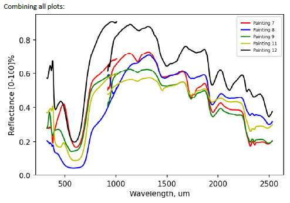
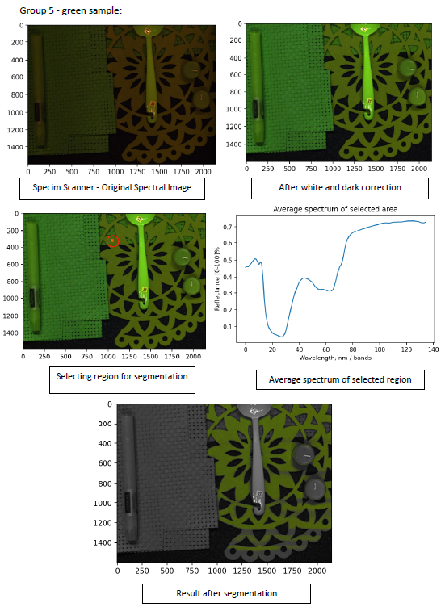

# Hyperspectral Image Processing and Analysis

## Different Hyperspectral Cameras Used
* Specim Scanner
* Specim IQ
* Nuance
* Tunable Light Source

## Processes
* Loading spectral images based on different formats - BIL, BIP and BSQ
* Resizing spectral images based on Lines size, sample size or bands
* White and Dark Correction
* Segmentation

## Analysing paintings after white correction - Specim Scanner Hyperspectral Images

  
   

## Segmentation - Specim Scanner Hyperspectral Image

